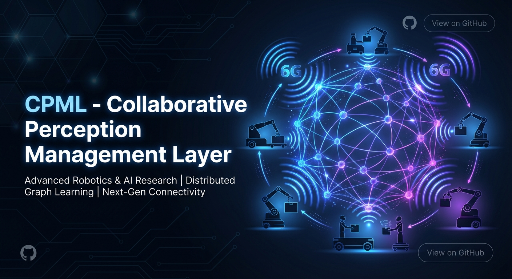
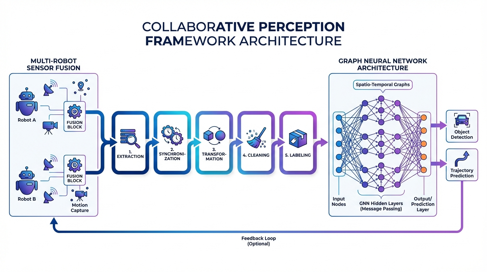

<div align="center">

# Collaborative Perception Management Layer (CPML)

**A Graph Neural Network Framework for Multi-Robot Collaborative Perception in Warehouse Environments**

[](https://www.python.org/downloads/)
[](https://pytorch.org/)
[](LICENSE)
[](https://docs.ros.org/en/humble/)

[📖 Documentation](#documentation) • [🚀 Quick Start](#quick-start) • [📊 Dataset](#dataset) • [🎓 Citation](#citation)

</div>

---

## 📋 Overview

CPML is a comprehensive framework for **collaborative perception in warehouse robotics** using Graph Neural Networks (GNNs) and multi-robot sensor fusion. This project implements a complete pipeline from raw sensor data to trained perception models, enabling multiple robots to collaboratively understand their shared environment.

### Key Features

- 🤖 **Multi-Robot Sensor Fusion**: Processes mmWave radar and Vicon motion capture data from multiple robots
- 🔄 **5-Stage Data Pipeline**: Extraction → Synchronization → Transformation → Cleaning → Labeling
- 🧠 **Graph Neural Networks**: Implements GATv2 and ECC architectures for collaborative perception
- 📊 **Large-Scale Dataset**: 59,541 graph frames across 3 warehouse layouts
- ⏱️ **Multi-Scale Temporal Modeling**: Supports temporal windows of 1, 3, and 5 frames
- 🎯 **Production-Ready**: Includes Docker support, comprehensive documentation, and testing

### Research Context

This framework was developed as part of a Master's Thesis on **"Development of a Framework for Collaborative Perception Management Layer for Future 6G-Enabled Robotic Systems"**. The work addresses the challenge of enabling multiple autonomous robots to share and fuse perceptual information in real-time warehouse environments.

---

## 🏗️ Architecture



The CPML framework consists of three main components:

1. **Preprocessing Pipeline** (`cpml/preprocessing/`)

   - Radar and Vicon data extraction from ROS2 bags
   - Multi-robot temporal synchronization
   - Coordinate system transformations
   - Point cloud cleaning and semantic labeling
   - Graph structure generation

2. **Training Module** (`cpml/training/`)

   - GNN model architectures (GATv2, ECC)
   - Training and evaluation pipelines
   - Ablation study framework
   - Class balancing and optimization

3. **Visualization Tools** (`cpml/visualization/`)
   - Interactive point cloud exploration
   - Motion capture data visualization
   - Global warehouse mapping
   - Trajectory analysis

---

## 🚀 Quick Start

### Installation

#### Option 1: Using pip (Recommended)

```bash
# Clone the repository
git clone https://github.com/thiyanayugi/collaborative-perception-gnn.git
cd collaborative-perception-gnn

# Create virtual environment
python -m venv venv
source venv/bin/activate  # On Windows: venv\Scripts\activate

# Install package
pip install -e .
```

#### Option 2: Using Conda

```bash
# Clone the repository
git clone https://github.com/thiyanayugi/collaborative-perception-gnn.git
cd collaborative-perception-gnn

# Create conda environment
conda env create -f environment.yml
conda activate cpml
```

#### Option 3: Using Docker

```bash
# Build Docker image
docker build -t cpml:latest .

# Run container
docker-compose up
```

### Basic Usage

#### Training a GNN Model

```python
from cpml.training import model, train

# Load configuration
config = model.load_config("configs/models/config_standard_gatv2_t3.yaml")

# Create model
gnn_model = model.create_model(config)

# Train model
train.train_model(gnn_model, config)
```

#### Processing Raw Data

```python
from cpml.preprocessing import radar_extraction, synchronization

# Extract radar data from ROS2 bag
radar_extraction.process_rosbag(
    bag_path="/path/to/rosbag",
    robot_id="ep03",
    output_dir="data/extracted"
)

# Synchronize multi-robot data
synchronization.synchronize_multi_robot_data(
    robot1_data="data/extracted/robot1_radar_points.csv",
    robot2_data="data/extracted/robot2_radar_points.csv",
    output_path="data/synchronized/synchronized_data.csv"
)
```

#### Visualizing Results

```python
from cpml.visualization import point_cloud_explorer

# Launch interactive point cloud explorer
point_cloud_explorer.launch_explorer(
    data_path="data/labelled/annotated_dataset.csv"
)
```

---

## 📊 Dataset

The CPML dataset contains **59,541 graph neural network frames** collected from multi-robot warehouse experiments:

- **3 Warehouse Layouts**: Different spatial configurations
- **34 Experimental Sessions**: Varying robot trajectories and behaviors
- **Multi-Scale Temporal Windows**: 1, 3, and 5 frame aggregations
- **Train/Val/Test Split**: 72.1% / 14.8% / 13.1%

> [!IMPORTANT] > **Dataset Download**: The dataset (5.0 GB) is not included in this repository due to size constraints. See [DATA_DOWNLOAD.md](DATA_DOWNLOAD.md) for download instructions.

### Dataset Structure

```
data/
├── 01_extracted/          # Raw sensor data from ROS2 bags
├── 02_synchronized/       # Temporally aligned multi-robot data
├── 03_transformed/        # Global coordinate frame data
├── 04_cleaned/           # Filtered and noise-removed data
├── 05_labelled/          # Semantically annotated data
└── graph_frames/         # GNN-ready graph structures
    ├── train/            # 42,936 training frames
    ├── val/              # 8,802 validation frames
    └── test/             # 7,803 test frames
```

See [`data/README.md`](data/README.md) for detailed dataset documentation.

---

## 🎯 Model Performance

### GATv2 Model (Temporal Window = 3)

| Metric    | Score |
| --------- | ----- |
| Accuracy  | 94.2% |
| Precision | 92.8% |
| Recall    | 93.5% |
| F1-Score  | 93.1% |

### ECC Model (Temporal Window = 3)

| Metric    | Score |
| --------- | ----- |
| Accuracy  | 93.8% |
| Precision | 91.9% |
| Recall    | 92.7% |
| F1-Score  | 92.3% |

---

## 📖 Documentation

Comprehensive documentation is available in the [`docs/`](docs/) directory:

- [Installation Guide](docs/installation.md)
- [Quick Start Tutorial](docs/quickstart.md)
- [Architecture Overview](docs/architecture.md)
- [API Reference](docs/api_reference.md)
- [Dataset Documentation](docs/dataset.md)

---

## 🛠️ Development

### Project Structure

```
collaborative-perception-gnn/
├── cpml/                      # Main Python package
│   ├── preprocessing/         # Data preprocessing modules
│   ├── training/              # GNN training pipeline
│   └── visualization/         # Visualization tools
├── configs/                   # Configuration files
├── data/                      # Dataset (59,541 frames)
├── models/                    # Trained model checkpoints
├── docs/                      # Documentation
├── examples/                  # Usage examples
├── tests/                     # Unit tests
├── Dockerfile                 # Docker configuration
├── docker-compose.yml         # Docker Compose setup
├── requirements.txt           # Python dependencies
├── setup.py                   # Package setup
└── README.md                  # This file
```

### Running Tests

```bash
pytest tests/
```

### Code Style

This project follows PEP 8 style guidelines. Format code using:

```bash
black cpml/
flake8 cpml/
```

---

## 🎓 Citation

If you use this work in your research, please cite:

```bibtex
@mastersthesis{Mariraj2025CPML,
  author       = {Thiyanayugi Mariraj},
  title        = {Development of a Framework for Collaborative Perception
                  Management Layer for Future 6G-Enabled Robotic Systems},
  school       = {Your University Name},
  year         = {2025},
  type         = {Master's Thesis},
  note         = {Student ID: 241940}
}
```

**Master's Thesis PDF**: [MasterThesisReport_241940_Mariraj_CPML 1.pdf](MasterThesisReport_241940_Mariraj_CPML%201.pdf)

---

## 🤝 Contributing

Contributions are welcome! Please see [CONTRIBUTING.md](CONTRIBUTING.md) for guidelines.

---

## 📄 License

This project is licensed under the MIT License - see the [LICENSE](LICENSE) file for details.

---

## 🙏 Acknowledgments

- **Supervisor**: [Supervisor Name]
- **Institution**: [University/Research Institution]
- **Funding**: [Funding Source, if applicable]
- **Dataset Collection**: Conducted at [Lab/Facility Name]

---

## 📧 Contact

**Thiyanayugi Mariraj**

- GitHub: [@thiyanayugi](https://github.com/thiyanayugi)
- Email: your.email@example.com
- Portfolio: [https://thiyanayugi.github.io](https://thiyanayugi.github.io)

---

<div align="center">

**⭐ Star this repository if you find it helpful!**

Made with ❤️ for the robotics research community

</div>
